# LaTeX Learning Notes_Part01

by rjp

2019_01_11 started


2019年1月30日09:07:48

学习笔记不应该这么写

应该是自己把书看一遍

自己总结, 现在我搞成了抄书

这个笔记要废弃掉

[TOC]

## 0. The Preface

同样的时间花在word和LaTeX上, 可能两者排版出的文档一样漂亮

但是我更喜欢LaTeX, 它排版格式可以通过代码控制

语句, 公式, 引用, 图片皆有迹可循


自己前前后后, 也零散地接触过 LaTeX

甚至还用 LaTeX 写了很多文档, 大地测量实习, 老张的两门课等等

炜哥给过我两本 LaTeX 教材, 一本中文, 一本英文

恕我直言, 中文书就是屎一样, 根本没有逻辑框架, 单纯告诉你语法

英文书深入浅出, 循循善诱, 读起来非常享受

当时在 wjx 家旁边的书店里把英文教程看了很多

时过境迁, 长时间不用 LaTeX, 忘得差不多了

重新看, 系统地学习一遍 LaTeX

 

所参考教材为

 [LaTeX Tutorials A PRIMER](https://www.tug.org.in/tutorials.html) 

作者: Indian TEX User Group

地点: Trivandrum, India

时间: 2003 September

由于教材为英文, 所以学习笔记也使用英文


## 1. The Basics

### 1.1 What is LaTeX?

LaTeX is a typesetting program originating from TEX written by Donald Knuth.

Hers are four steps in preparation of documents using computers.

1. the text entered into computer.
2. input text formatted into lines, paragraphs and pages.
3. output text displayed on computer screen.
4. final output is printed.

Typesetting program focus on the 2nd step.

- A small example

  ```latex
  \documentclass{article}
  \begin{document}
  This is my \emph{first} document prepared in \LaTeX
  \end{document}
  ```

   `\` character is called *backslash*.

- Why LaTeX?

  why not simplified the word processor?

  LaTeX is aimed at creating **beautifully** typeset technical documents especially those containing a lot of Mathematics.

### 1.2 Simple Typesetting

The end of a paragraph is specified by a blank line in the input.

If you do not want the indent, it's good to add `\noindent` in the start of each paragraph

 #### 1.2-1 Spaces

To make sure the length of output lines is equal, TEX will adjust the space between the words.

A little extra space is added to periods which end sentences. 

**period: in one line, the blank space between 2 sentences** by rjp.

How does TEX know that it's the end of a sentence? 

It assumes that every period **not following an upper case letter **ends a sentence.

What if a sentence ends up with a upper case letter? For example: 

 `Carrots are good for your eyes, since they contain Vitamin A. Have you ever seen a rabbit wearing glasses?` 

Add the command `\@` before the period.

Tried this on VsCode, the result is:


And what if there is a low case letter, but not end the sentence, like:

 `The numeber 1, 2, 3, etc. are called natural numbers. According to Kronecker, they were made by God; all else being the work of Man.` 

Add the command `\` before the period.

Tried on VsCode, the result is:


#### 1.2-2 Quotes

Try `Note the difference in right and left quotes in 'single quotes' and "double quotes".` in LaTeX, you will find something like:

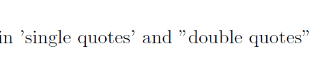

So recommend to use command `\lq` representing left single quotes, and  `\rq` representing right sinlge quotes. `\lq\lq` will represent left double quotes, and `\rq\rp` means right double quotes. 

#### 1.2-3 Dashes

Single dash `-` produces a hyphen, two dashes `--` produce a longer dash, three dashes `---` produce the longest dash.

#### 1.2-4 Accents(skip)

#### 1.2-5 Special symbols

Use symbol `\` to indicate the program that what follows should not be typeset,

but an instruction to be carried out.

If you want to type `\` , use `\textbackslash` 

Use `%` symbol to make comment, which means what behind `%` will not be typeset.

If you want to type `%` , use `\%` .

Here are 10 symbols like `%` or `\` , if you want type any of them, preceding them with a `\` ,

 `~` , `#` , `%` , `^` , `&` , `_` , `\` , `{` , `}` 

with 3 exception below.

 `~` : `\textasciitilde` 

 `^` : `\textasciicircum` 

 `\` : `\textbackslash`

Because `\\` used to break lines, also we can give a optional parameter to increase the distance between the lines. For example:

 `This is the first line.\\[10pt] This is the second line.` 

#### 1.2-6 Text positioning

suppose you wanna type something like:

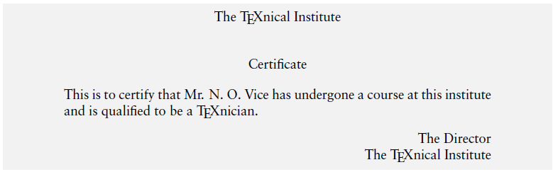

This is produced by 

```latex
% text between `begin` and `end` is aligned in the middle of page
\begin{center} 
The \TeX nical Institute\\[0.75cm]
Certificate
\end{center}
% no indent
\noindent This is to certify that Mr.N.O. Vice has undergone a course at this institute and is qualified to be a \TeX nicain.
% typeset text flush with the right margin
\begin{flushright}
The Director\\
The \TeX nical Institute
\end{flushright}
```

These examples are an illustration of a LaTeX construct called **environment**, which is of the form like: `\begin{env_name} ... \end{env_name}` 

### 1.3 Fonts

The actual letters and symbols (collectively called **type**) that LaTeX produces are characterized by their **style** and **size**. A set of types of a particular style and size is called a **font**.

#### 1.3-1 Type style

In LaTeX, a type style is specified by **family**, **series** and **shape**. Any type in the output is a combination of these three characteristics.

Here is the table:

<table>
    <!-- first block -->
	<tr>
        <th>   </th>
        <th> TYPE </th>
        <th> COMMAND </th>
    </tr>
    <tr>
        <td rowspan="3"> FAMILY </td>
        <td> roman </td>
        <td> \textrm{roman} </td>
    </tr>
    <tr>
        <td> sans serif </td>
        <td> \textsf{sans serif} </td>
    </tr>
    <tr>
        <td> typewriter </td>
        <td> \texttt{typewriter} </td>
    </tr>
    <!-- second block -->
    <tr>
        <td rowspan="2"> SERIES </td>
        <td> medium </td>
        <td> \textmd{medium} </td>
    </tr>
    <tr>
        <td> boldface </td>
        <td> \textbf{boldface} </td>
    </tr>
    <!-- third block -->
    <tr>
        <td rowspan="4"> SHAPE </td>
        <td> upright </td>
        <td> \textup{upright} </td>
    </tr>
    <tr>
        <td> italic </td>
        <td> \textit{italic} </td>
    </tr>
    <tr>
        <td> slanted </td>
        <td> \textsl{slanted} </td>
    </tr>
    <tr>
        <td> SMALL CAP </td>
        <td> \textsc{smalll cap} </td>
    </tr>
</table>


When command `\emph` in the middle of normal text, it produces italic shape.

When the current type is slanted or italic, then `\emph` switches to upright type.

And each of these type command has an alternate form as a **declaration**.

For example, instead of `\textbf{boldface}` , you can type `{\bfseries boldface}` 

#### 1.3-2 Type size

The default type TEX produces is of 10 pt size. There are some **decarations** provided in LaTeX for changing the type size. Have a try in LaTeX.

 `{\tiny size}` 

 `{\scriptesize size}` 

 `{\footnotesize size}` 

 `{\small size}` 

 `{\normalsize size}` 

 `{\large size}` 

 `{\Large size}` 

 `{\LARGE size}` 

 `{\huge size}` 

 `{\Huge size}` 

Unlike the style changing commands, there are no **command-with-one-argument** forms for these declarations.

Now, retry the certificate:

```latex
\begin{center}
	{\bfseries\huge The \TeX nical Institute}\\[1cm]
	{\scshape\LARGE Certificate}
\end{center}

\noindent This is to certify that Mr.N.O. Vice has undergone a course at this institute and is qualified to be a \TeX nical Expert.

\begin{flushright}
{\sffamily The Director\\
The \TeX nical Institute}
\end{flushright}
```


## 2. The Document

### 2.1 Document Class

We now describe how an entire document with chapters and sections and other embellish-ments can be produced with LaTeX. All LaTeX files should begin by specifying the kind of document to be produced, using the command `\documentclass{}` .

For a short article, we use `\documentclass{article}` .

For books, we use `\documentclass{book}` . Also there are other document class as `report` and `letter` .

We can also specify some options which modify the default format. Thus the actual syntax of the document class is `\documentclass[options]{class}` . Note the **options** are given in **square brackets** not braces.

You can describe the options in three aspects: **font size**, **paper size** and **page format**

- font size: **10pt**, **11pt**, **12pt**

- paper size: **letterpaper**, **legalpaper**, **executivepaper**, **a4paper**, **a5paper**, **b5paper**

- page format

  - **onecolumn**, **twocolumn**

  - **oneside**, **twoside**

    oneside is default for article, report and letter; **twoside is default for book**. The page numbers is always on the outside when it's twoside.

  - **openany**, **openright**

    In the report and book class, there is a provision to specify the different chapters. Chapters always begin on a new page, leaving blank space in the previous page, if necessary. With the book class there is the additional restriction that chapters begin only on odd-numbered pages, leaving an entire page blank, if need be.

    The default is openany for report class and openright is default for book class.

  - **notitlepage**, **titlepage**

    There is also a provision in LATEX for formatting the title (the name of the document,
    author(s) and so on) of a document with special typographic consideration. In the
    article class, this part of the document is printed along with the text following on the
    first page, while for report and book, a separate title page is printed.

    The default is notitlepage for article and titlepage for report and book.

### 2.2 Page Style

Having decided on the overall appearance of the document through the `\documentclass` 
command with its various options, we next see how we can set the style for the individual
pages. In LATEX parlance, each page has a “head” and “foot” usually containing such
information as the current page number or the current chapter or section. 

Just what goes where is set by the command `\pagestyle{...}` 

and mandatory argument can be any one of these following styles:

`plain` , `empty` , `headings` , `myheadings` 

The behavior pertaining to each of these is given below:

- **plain**: 

  The page head is empty and the foot contains just the page number, centered with respect to the width of the text. This is the default for the article class if no `\pagestyle` is specified in the preamble.

- **empty**:

  Both the head and foot are empty. In particular, no page numbers are printed.

- **headings**:

  This is the default for the book class. The foot is empty and the head contains the page number and names of the chapter section or subsection, depending on the document class and its options as given below:

  <table>
      <tr>
      	<th> CLASS </th>
      	<th> OPTION </th>
      	<th> LEFT PAGE </th>
      	<th> RIGHT PAGE </th>
      </tr>
      <tr>
      	<td rowspan="2"> book, report </td>
          <td> one-sided </td>
          <td> --- </td>
          <td> chapter </td>
      </tr>
      <tr>
      	<td> two-sided </td>
          <td> chapter </td>
          <td> section </td>
      </tr>
      <tr>
      	<td rowspan="2"> article </td>
          <td> one-sided </td>
          <td> --- </td>
          <td> section </td>
      </tr>
      <tr>
      	<td> two-sided </td>
          <td> section </td>
          <td> subsection </td>
      </tr>
  </table>

- **myheadings**:

  The same as headings, except that the section information in the head are not predeter-mined, but to be given explicitly using the commands `\markright` or `\markboth ` .

   `\markboth{left_head}{right_head}` 

   `\markright{right_head}` 

  Customize what is on the head of page

  The `\markboth` command is used with the **twoside** option with even numbered pages
  considered to be on the left and odd numbered pages on the right. And `\markright` command is used for the **oneside** option.

We can customize the current page by the command `\thispagestyle{style}` .

### 2.3 Page Numbering

 `\pagenumbering{...}` command, the argument is shown below:

| Argument |           Style           |
| :------: | :-----------------------: |
|  arabic  |   Indo-Arabic numberals   |
|  roman   | lowercase Roman numberals |
|  Roman   | uppercase Roman numberals |
|   alph   | lowercase English letters |
|   Alph   | uppercase English letters |

Command `\pagenumbering{...}` will reset the page counter.

We can make the page start with any number we want by command:

 `\setcounter{page}{number}` 

this command will also reset the page counter, and the following page will continue the set page number.

### 2.4 Formatting lengths

Each page LaTeX produces consists not only of a **head** and **foot**, but also a **body**, which contains the actual text. You can use command `\setlength{\textwidth}{15cm}` makes the width of text 15cm. The package **geometry** gives easier way to customize page format.

### 2.5 Parts of Document

We now turn our attention to the document itself. Documents are divided into **chapters**, **sections** and so on. There may be a little part like **title**, **abstract**.

#### 2.5-1 Title

```latex
\title{document_names}
\author{author_names}
\date{date_text}

\maketitle % make sure the title part to be typeset
```

If the title is too long, use command `\\` to break it at appropriate place; If there are several authors and their names are separated by `\and` command

The command `\thanks{footnote_text}` can be given at any point within `\title` , `\author` , `\date` 

#### 2.5-1 Abstract

In the document classes **article** and **report**, you can produce abstract by the command:

```latex
\begin{abstract}
Abstract Text
\end{abstract}
```

### 2.6 Dividing the document

LaTeX provides the following hierarchy of sectioning commands in the **book** and **report** class:

 `\chapter` , `\section` , `\subsection` , `subsubsection` , `paragraph` , `subparagraph` 

Except for `\chapter` , all these are available in **article** class. For example:

```latex
\section{1111}
    \subsection{1}
\section{2222}
    \subsection{1}
    \subsection{2}
```

The result is like:

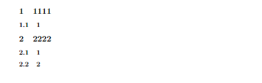

So you do not have to set up the number of every section by yourself, LaTeX will do it for you.

- book and report

  In the book and the report classes, the `\chapter` command shifts to the beginning of a new page and prints the word “Chapter” and a number and beneath it, the name we have
  given in the argument of the command. The \section command produces two numbers
  (separated by a dot) indicating the chapter number and the section number followed by the name we have given. It does not produce any text like “Section”. Subsections have three numbers indicating the chapter, section and subsection. Subsubsections and commands below it in the hierarchy do not have any numbers.

- article

  In the article class, `\section` is highest in the hierarchy and produces single number like `\chapter` in book. (It does not produce any text like “Section”, though.) 

  In this case, subsubsections also have numbers, but none below have numbers.

Each sectioning command also has a “starred” version which does not produce numbers. Thus `\section*{name}` has the same effect as `\section{name}` , but produces no number for this section.

Some books and longish documents are divided into parts also. LATEX also has a `\part` command for such documents. In such cases, \part is the highest in the hierarchy, but it does not affect the numbering of the lesser sectioning commands.

You may have noted that LATEX has a specific format for typesetting the section headings, such as the font used, the positioning, the vertical space before and after the heading and so on. <font color=red>All these can be customized, but it requires some TEXpertise and cannot be addressed at this point.</font> However, the package **sectsty** provided some easy interfaces for tweaking some of these settings.

### 2.7 What's next?

The task of learning to create a document in LATEX is far from over. There are other things to do such as **producing a bibliography** and a method to refer to it and also at the end of it all to **produce a table of contents** and perhaps an index. 

All these can be done efficiently (and painlessly) in LATEX, but they are matters for other chapters


## 3. Bibliography

### 3.1 Introduction

Bibliography is the environment which helps the author to cross-reference one publication from the list of sources at the end of the document. LaTeX helps authors to write a well structured bibliography. Package **harvard** and **natbib** are widely used for generating bibliography.

To produce bibliography, we have the environment **thebibliography**, which is similar to the **enumerate** environment. Here we use the command `\bibitem` to separate the entries in the bibliography and use `\cite` to refer to a specific entry from this list in the document.

```latex
% widest-label indicates the width of the widest label in the bibliography
% the key is a mnemonic string used got cite the publication within the 
% document text. Key can be any sequence of letters, digits and punctuation 
% characters, except that it may not contain a comma (maximum 256 characters)
\begin{thebibliography}{widest-label}
	\bibitem{key1}
	\bibitem{key2}
\end{thibibliography}
```

Example:

```latex
It is hard to write unstructured and disorganised documents using \LaTeX˜\cite{les85}.It is interesting to typeset one equation˜\cite[Sec 3.3]{les85} rather than setting ten pages of running matter˜\cite{don89, rondon89}.

\begin{thebibliography}{9}
    \bibitem{les85}Leslie Lamport, 1985. \emph{\LaTeX---A Document Preparation System---User’s Guide and Reference Manual}, Addision-Wesley, Reading.
    \bibitem{don89}Donald E. Knuth, 1989. \emph{Typesetting Concrete Mathematics}, TUGBoat, 10(1):31-36.
    \bibitem{rondon89}Ronald L. Graham, Donald E. Knuth, and Ore Patashnik, 1989. \emph{Concrete Mathematics: A Foundation for Computer Science}, Addison-Wesley, Reading.
\end{thebibliography}
```

The result is : 

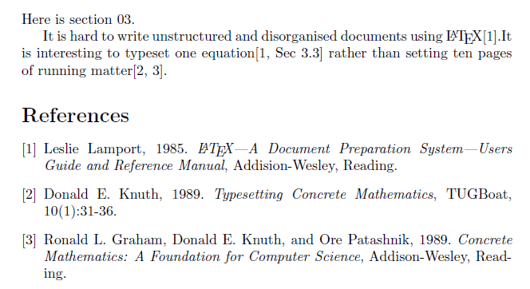

### 3.2 Natbib

The **natbib** package is widely used for generating bibliography, because of its flexible interface for most of the available bibliographic styles. The **natbib** package is a reimplementation of the LATEX \cite command, to work with both author–year and numerical citations.

Use command `\usepackage[options]{natbib}` to load the package

 [包环境设置01](http://merkel.texture.rocks/Latex/index.php?lang=en)

 [包环境设置02](https://tex.stackexchange.com/questions/166840/why-do-i-get-author-when-i-use-citet-with-natbib)


## 4.Bibliographic Databases

<font color=red>**ATTETION USE pdflatex->bibtex->pdflatex->pdflatex TO BUILD THE PROJECT**</font>

Bibliographic database is a database in which all the useful bibliographic entries can be stored. The information about the various publications is stored in one or more files with the extension `.bib` . For each publication, there is a key that identifies it and which may be used in the text  document to refer to it. 

### 4.1 The BIBTEX Program

BIBTEX is an auxiliary program to LATEX that automatically constructs a bibliography for a LaTeX document from one or more databases.

 `\bibliography{database1, database2... }` specifies one or more files including database.

To use BIBTEX, you source file must contain a command `\bibliographysytle` command which determines the format of source list. The command can be anywhere after `\begin{document}` .

### 4.2 BIBTEX Style Files

The options of command `\bibliographystyle{options}` are:

 `plain` , `unsrt` , `alpha` , `abbrv` , `acm` , `apalike` 

- `plain` : Standard BIBTEX style. Entries sorted alphabetically with numeric labels.
- `unsrt` : Standard BIBTEX style, order of citation and numeric labels.
- `alpha` : Standard BIBTEX style, formed from author's name and the year of publication.
- `abbrv` : Standard BIBTEX style, more compact, all abbreviated.
- `acm` : Alternative BIBTEX style, for Association for Computing Machinery.
- `apalike` : Alternative BIBTEX style, for American Psychology Association.

All the style is defined by a `.bst` , so it's easy to customize.

Steps for running BIBTEX with LaTeX: 

1. Run LaTeX, which generates a list of `\cite` reference in its `.aux` .

2. Run BIBTEX, which reads the `.aux` , try to find reference in a database. Attention, BIBTEX never read source file `.tex` . In this step, it will generate `.bbl` .

3. Run LaTeX again, it will read `.bbl` reference files.

4. Run LaTex again, it will resolve all the references.

### 4.3 Creating A Bibliographic Database 

<font color=red>**SKIP RIGHT NOW**</font>


## 5. Table of Contents, Index and Glossary

### 5.1 Table of Contents

A **table of contents** is a special list which contains the section numbers and corresponding headings as given in he standard form of the sectioning commands, together with the page number on which they begin. 

The **list of tables** and **list of figures** containing reference information about floating elements in the document is similar to **table of contents**, but much easier since their contents, their captions are on the same level.

Standard LaTeX can automatically create these three contents lists and put them in the file `.toc` , `.lof` , `.lot` representing `tableofcontents` , `listoffigures` , `listoftables` .

 `.toc` organizes the table of contents by the `\section` command in the `.tex` ;  

 `listoffigures` and `listoftables` are organized by the command `\caption` in the `.tex` 

 `\tableofcontents` produces a table of contents.

 `\listoffigures` and `listoftables` produces a list of figure and list of tables respectively.

These list are printed where the commands are issued.

If you are not satisfied with the LaTeX default, you can try the formatting command, like 

 `\addtocontents` 

#### 5.1-1 Additional entries

 `\addtocontents{file}{text}` 

 `\addcontentsline{file}{type}{text}` 

file: `toc` , `lof` , `lot` 

type: The type of entry. For `lof` or `lot` files, **figure** or **table** is  specified.

text: The actual information to be written to the file mentioned. LaTeX commands should be protected by `\protect` to delay expansion.

- command `\addtocontents{file}{text}` :

  use command `\addtocontents{toc}{\protect\vspace{2ex}}` to generate addtional spacing in the middle of a table of contents. Here is the difference of before and after:

  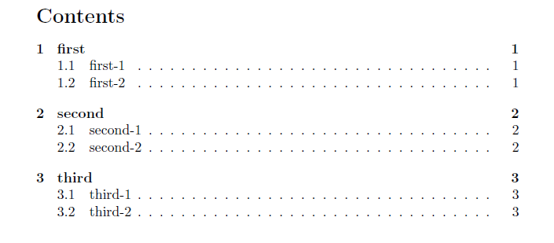


  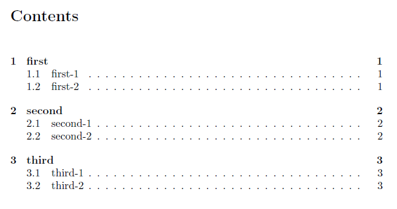

  Apparently, the distance between **Contents** and **below** is much longer.

  It is something like add command to the file you mentioned, and change the typesetting of the content or the list.

- command `\addcontentsline{file}{type}{text}` :

   `\addcontentsline` is usually invoked automatically by the **sectioning command**, or by the `\caption` commands.

  It is something like you could customize the list or the content. 

#### 5.1-2 Typesetting a contents list

Custimze the table of contents by yourself. In my opinion, it's better take a look at `.toc` file. 

```latex
\contentsline {section}{\numberline {1}first}{1}
\contentsline {subsection}{\numberline {1.1}first-01}{1}
\contentsline {subsection}{\numberline {1.2}first-02}{2}
\contentsline {section}{\numberline {2}second}{3}
\contentsline {subsection}{\numberline {2.1}second-01}{3}
\contentsline {subsection}{\numberline {2.2}second-02}{4}
\contentsline {section}{\numberline {3}third}{5}
\contentsline {subsection}{\numberline {3.1}third-01}{5}
\contentsline {subsection}{\numberline {3.2}third-02}{6}
```

These codes generate the table of contents mentioned in the [5.1-1](#5.1-1 Additional entries)

Apparently, the command `\numberline` is to generate the beautiful number.

To format an entry in the table of contents files, standard LaTeX makes use of the following command: `\@dottedtocline{level}{indent}{numwidth}{text}{page}` 

- level: the nesting level of the content you want to add. If the level is bigger than the toc depth, it will not be added.
- indent: total indentation from the left margin
- numwidth: The width of the box that contains the number if text has a `\numberline ` command. This is also the amount of extra indentation added to the second and later lines of a multiple line entry

the last 2 parameters coincide with command `\contentsline{}` 

#### 5.1-3 Multiple tables of contents

The `minitoc` package creates a mini-table of contents at the beginning of each chapter when use book or report class. The mini-table will appear at the beginning of a chapter, after `\chapter` command. 

<font color=red>**SKIP**</font>


### 5.2 Index

Important to use index to find a topic of interest.

### 5.3 Glossary

<font color=red>**SKIP**</font>


## 6.Displayed Text

When we want to seperate a portion of text from its surrounding metarial, one method of doing this is to typeset the distinguished text with added indentation. It is called displaying.

### 6.1 Borrowed Words

If the quote is one-liner, we can simply produce it with double-quotes.

But if the quotation is several lines long, use the *environment* `quote` like:

```latex
% single paragraph
\begin{quote}
	...
\end{quote}

% several paragraphes
\begin{quotation}
...
...
\end{quotation}
```

### 6.2 Poetry In Typesetting

Use *environment* `verse` :

```latex
\begin{verse}
line\\
line % to seperate different stanzas

line
line\\* % to make couplet in the same page
line\\[5pt] % control the distance between lines 
\end{verse}
```

### 6.3 Making Lists

Use *environment* `itemize` :

```latex
\begin{itemize}
    \item first level
        \begin{itemize}
            \item second level
            \begin{itemize}
                \item third level
                    \begin{itemize}
                        \item fourth level
                    \end{itemize}
            \end{itemize}
        \end{itemize}
\end{itemize}
```

Not satisfied with default, try this: 

```latex
{\renewcommand{\labelitemi}{$\triangleright$}}
\begin{itemize}
	\item first item
	\item second item
\end{itemize}
```

### 6.4 When Order Matters

Use *environment* `enumerate` 

```latex
\begin{enumerate}
	\item item1
	\item item2
\end{enumerate}
```

If you want to customize the label of `enumerate` , use package `enumerate` and write in `.tex` like this :

```latex
\begin{enumerate}[i.]
	\item item1
	\item item2
\end{enumerate}
```

And something more complicated like:

```latex
% set the horizon space, font and style of label
% also you can set the indent of label
% itemindent = 5pt
\begin{enumerate}[\hspace{0.5cm} \bfseries Step 1.]
    \item item1
    \item item2
        \begin{enumerate}
            \item item1
            \item item2
            \item item3  
        \end{enumerate}
    \item item3
\end{enumerate}
```

### 6.5 Description And Definitions

Use *environment* `description` :

```latex
\renewcommand{\descriptionlabel}[1]{\hspace{1cm}\textsf{#1}}
\begin{description}
    \item[rjp] myself
    \item[tj] tongji university
    \item[zsm] my teacher  
\end{description}
```

It's time to talk about the three list environment we have seen:

 `itemize` , `enumerate` , `description` 

In any of case, we can override the default labels by the environment.

```latex
The real number $l$ is the least upper bound of the set $A$ if it satisfies the following conditions 
\begin{enumerate}
	\item[(1)] $l$ is an upper bound of $A$
	\item[(2)] $2$ if $u$ is an upper bound of $A$, then $l\le u$  
\end{enumerate}
The second condition is equivalent to 
\begin{enumerate}
	\item[(2)$'$] If $a<l$, then $a$ is not an upper bound of $A$
\end{enumerate}
```


## 7. Rows And Columns

Sometimes we want the second result not the first result by *environment* `description` 

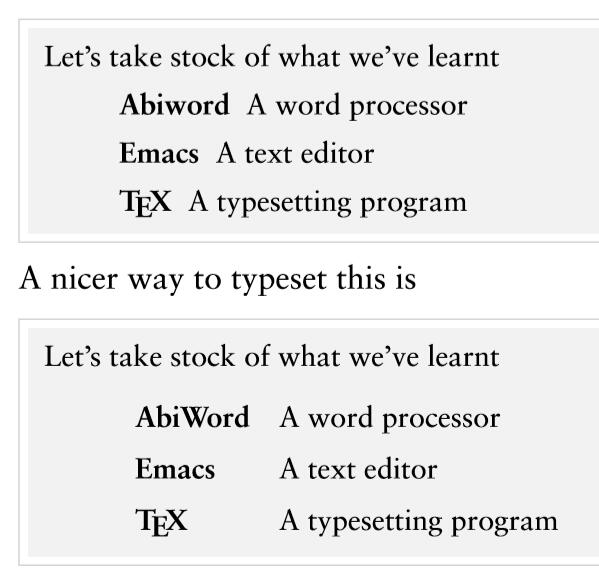

Here the 3 rows of text are visually separated into 2 columns of left aligned text which is produced by `tabbing` environment.

### 7.1 Keeping Tabs

#### 7.1-1 Basics

The code is below: 

```latex
Let's take stock of what we have learnt
\begin{tabbing}
    \hspace{1cm}\= \textbf{AbiWord}\quad\=A Word Processer\\[5pt]
                \> \textbf{Emacs} \>A text Editor\\[5pt]
                \> \textbf{\TeX} \> A typesetting program 
\end{tabbing}
```

And the result is like:

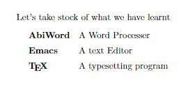

 `\=` divides `tab` : 2 `\=` indicates there are 3 tabs

 `\>` follow the first line `tab` , the *follow* means keeping the same distance between tab1 and tab2 in second line(or third, fourth, so on.) as the first line. And this distance is only determined by what between `\=` the first line.

So here is a problem, when the first line's tab1 is much shorter than third line's, it will result in something like: 

```latex
Let's take stock of what we have learnt
\begin{tabbing} 
    \textbf{\TeX}\quad\= A typesetting program\\[5pt]
    \textbf{Emacs}\quad\>A text Editor\\[5pt]
    \textbf{AbiWord}\quad\>A Word Processer
\end{tabbing}
```


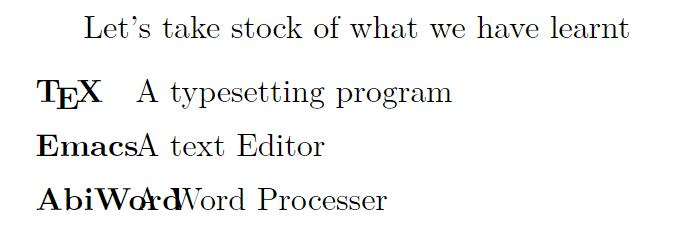

 `Word Processor` is override by previous tab `AbiWord` , when that shit happens, use *dummy line*  command `\kill` which makes the first line disappear in the `.pdf` .

```latex
Let's take stock of what we have learnt
\begin{tabbing} 
	\textbf{AbiWord}\quad\=A Word Processor\kill
    \textbf{\TeX}\quad\> A typesetting program\\[5pt]
    \textbf{Emacs}\quad\>A text Editor\\[5pt]
    \textbf{AbiWord}\quad\>A Word Processer
\end{tabbing} 
```

The function of *dummy line* is just to control the distance of every tab

You can also use string `sssssssss...ssss` to alternative, like:

```latex
\begin{tabbing}
    sssssssssssss\quad\=: \=ssssssss\kill\\[5pt]
    Program\quad\> :\>\TeX\\[5pt]
    Author\quad\>:\>Donald Knuth\\[5pt]
    Manuals\quad\>:\\
    \quad\= ssssssssssssssssssssssssssssssssssssss\=sssssssssssssssssssssss\=ssssssssssssssss\kill\\
        \>textsf{title}\>\textsf{author}\>\textsf{publisher}\\[8pt]
        \>The \TeX Book\>Donald Knuth\>publisher01\\[5pt]
        \>The Advanced \TeX\ Book\>David Salomon\>publisher02
\end{tabbing}
```

#### 7.1-2 Pushing and popping

What if you change the tab positions and then want the original settings back? Here’s where the command pair `\pushtabs` ... `\poptabs` is useful. Thus to typeset:

```latex
\begin{tabbing}
    sssssssssssss\quad\=: \=ssssssss\kill\\[5pt]
    Program> :\>\TeX\\[5pt]
    Author>:\>Donald Knuth\\[5pt]
    Manuals>:\\
   \pushtabs
   \quad\= ssssssssssssssssssssssssssssssssssssss\=sssssssssssssssssssssss\=ssssssssssssssss\kill\\
        \>textsf{title}\>\textsf{author}\>\textsf{publisher}\\[8pt]
        \>The \TeX Book\>Donald Knuth\>publisher01\\[5pt]
        \>The Advanced \TeX\ Book\>David Salomon\>publisher02\\[8pt]
    \poptabs
    Toturials\>:\>www.tex.com
\end{tabbing}
```

### 7.2 Tables

Use *environment* `tabular` 

```latex
\begin{tabular}{lr}
% l:first column aligned left
% r:second column aligned right
% every column line break by command \\
    Planet  &   Diameter(km)\\[5pt]
    Mercury &   4878\\
    Venus   &   12104\\
    Earth   &   6794\\
    Jupiter &   142984\\
    Saturn  &   120536\\
    Uranus  &   51118\\
    Neptune &   49532\\
    Pluto   &   2274
\end{tabular}
```

```latex
% table with row and column line
\begin{tabular}{|l|r|}
    \hline
    Planet  &   Diameter(km)\\[5pt]
    \hline        
    Mercury &   4878\\
    \hline
    Venus   &   12104\\
    \hline
    Earth   &   6794\\
    \hline
    Jupiter &   142984\\
    \hline
    Saturn  &   120536\\
    \hline
    Uranus  &   51118\\
    \hline
    Neptune &   49532\\
    \hline
    Pluto   &   2274\\
    \hline
\end{tabular}
```

The tabular options  has `l` , `r` , `c` , `q` , means aligned by left, right, center, paragraphbox

In a p-type column, if command `\raggedright` or `centering` is giving, the command `\\` will not change to next row, on the contrary, it break lines of the paragraph in the box. So if you want to break line and change to next row, use command `\tabularnewline[5pt]` which can terminate the scope of `\centering` or whatever.

```latex
\begin{tabular}{lp{6cm}} %{lp{0.8\linewidth}}
    Planet  &   Features\tabularnewline[8pt]
    Mercury &   \raggedright
    			Lunar like crust\\
    			crustal faulting\\
    			small magnetic fields.
    			\tabularnewline[3pt]
    Venus   &   \raggedright
    			Shrouded in clouds\\        
    			undulating surface with highlands, plains, lowlands and craters.
    			\tabularnewline[3pt]
    Earth   &   \raggedright
    			Ocens of water filling lowlands between continents\\
   				unique in supporting life, magnetic field.
   				\tabularnewline[3pt]
    Mars    &   \raggedright
    			Cratered uplands\\
    			lowland plains\\ 
    			volcanic regions.
    			\tabularnewline[3pt]
    Jupiter &   \raggedright
    			Covered by clouds\\
    			dark ring of dust\\
    			magnetic field.
                \tabularnewline[3pt]
    Saturn  &   \raggedright
    			Several cloud layers\\
    			magnetic field\\
    			thousands of rings.
    			\tabularnewline[3pt]
    Uranus  &   \raggedright
    			Layers of cloud and mist\\
    			magentic field\\
    			some rings.
    			\tabularnewline[3pt] 
    Neptune &   Unable to detect from earth.\tabularnewline[3pt]
    Pluto   &   Unable to detect from earth.
    % the last two line do not need \raggedright or \centering because they
    % do not have to break the line in paragraph
\end{tabular}
```

Remember the usage of command of `\multicolumn` , it could reset the position by the tabular parameter, like:

```latex
\begin{center}
\renewcommand{arraystretch}{1.2} % change the vertical distance
    \begin{tabular}{|l|c|c|}
        \hline
        Planet & \multicolumn{2}{p{4cm}|}{\centering Distance from sun\\ (million km)}\tabularnewline   % or \\
        \cline{2-3}
                & \multicolumn{1}{c|}{Maximum}  & \multicolumn{1}{c|}{Minimum}\\
        \hline
        Mercury & 69.40   & 46.80\\ \hline
        Venus & 109.00 & 107.60\\ \hline
        Earth & 152.60 & 147.40\\ \hline
        Mars & 249.20 & 207.30\\ \hline
        Jupiter & 817.40 & 741.60\\ \hline
        Saturn & 1512.00 & 1346.00\\ \hline
        Uranus & 3011.00 & 2740.00\\ \hline 
    \end{tabular}
\end{center}
```

Here are some important details:

`\multicolumn{num}{pos}{text}` *text* is gonna take *num* columns with the specified *pos*

1. When you set up the tabular's position, like: `\begin{tabular}{|r|c|c|}` is split to `|r|` , `c|` , `c|` .
2. *pos* is a one-parameter(like `c` , `|c` or `c|`) specification. When the *num* is bigger than one, it set all the columns with the *pos*.
3. When you use the command `\multicolumn` , it will override the pos defined by the tabular parameter which means flexible.
4. Use command `\renewcommand{\arraystretch}{1.2}` (default is 1) to setup the vertical distance between each rows. Put the command after `\begin{center}` .

And the example code above, use the `p` position specification. Use `\\` or `\tabularnewline` is alright thought the tutorial suggest `\\` for the reason that `centering` is in the scope of the `\multicolumn` .

If you want to use dash to separate the vertical columns, like:


use command `@` below, `r` represent aligned right in the left side, `l` represent aligned left in the right side.

```latex
\begin{center}
\renewcommand{\arraystretch}{1.3}
    \begin{tabular}{|c|r@{--}l|}
        \hline
        Height & \multicolumn{2}{|c|}{Ideal Weight}\\
        (cm) & \multicolumn{2}{c|}{(kg)}\\
        \hline
        155 & 53.5 & 64\\ \hline
        160 & 56 & 67\\ \hline
        165 & 59 & 71\\ \hline
        170 & 62.5 & 75.5\\ \hline
        175 & 66 & 79\\ \hline
        180 & 70 & 83.5\\ \hline
        185 & 71.5 & 86.5\\ \hline
        190 & 78 & 92.5\\ \hline
    \end{tabular}
\end{center}
```

#### 7.2-1 Enhancements to *tabular*

We will discuss a couple of packages here.

#### 7.2-2 The array package

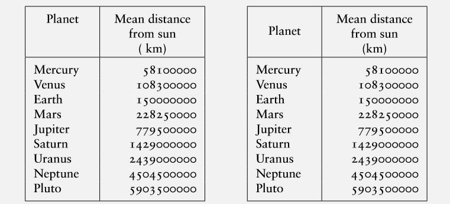

Guess everybody like the right one. Thus we need *array* package to control the position by specifying the parameter `m` .

```latex
\begin{center}
\renewcommand{\arraystretch}{1.3}
    \begin{tabular}{|>{\bfseries}c|c|}
        \hline
        \multicolumn{1}{|>{\bfseries}m{1.5cm}|}{\centering Planet}  &  \multicolumn{1}{m{2.3cm}|}{\centering Diameter\\ (km)} \\ \hline
        Mercury &   4878\\ \hline
        Venus   &   12104\\ \hline
        Earth   &   6794\\ \hline
        Jupiter &   142984\\ \hline
        Saturn  &   120536\\ \hline
        Uranus  &   51118\\ \hline
        Neptune &   49532\\ \hline
        Pluto   &   2274\\ \hline
    \end{tabular}
\end{center}
```

Let's analyze the code above, using package `array` with command `\usepackage{array}` 

1. Parameter `m` is kind of like parameter `p` . `|m{width}|` defines the width of the box and aligns vertically the text in the middle of box. The content in the third braces is defined same as specifier `p` also functions as `p` which aligns horizontally.
2. Package *array* has a  `>{decl}` command that can be used before a column specifier. It will insert *decl* directly in front of the column. In the code above, the style of text in the first column is of *bfseries*.
3. Package array has a `!` command same as `@` command, but does not suppress the intercolumn space.

#### 7.2-3 The multirow package

Wouldn’t it be nice if the entry “Planet” in the first column is vertically aligned with the center of the two rows in the next column as below?

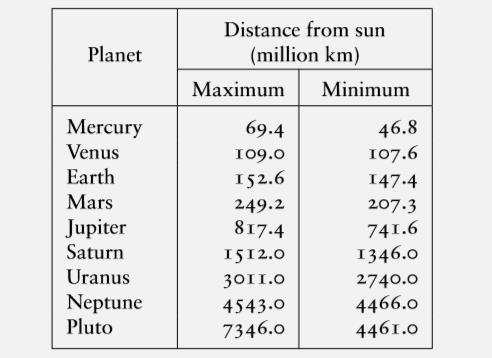

The package *multirow* is what we need to do this painlessly.

 `\multirow{num}{wd}{item}` : *num* is the rows to be spanned, *wd* is the width of this column and *item* is the text of the item in this column.

```latex
\begin{center}
\renewcommand{\arraystretch}{1.3}
\renewcommand{\multirowsetup}{\centering}
    \begin{tabular}{|c|c|c|}
        \hline
        \multirow{2}{3cm}{\centering Planet} & \multicolumn{2}{p{6cm}|}{\centering Distance from sun\\ (km)}\\
        \cline{2-3}
                & Maximum    & Minimum\\
        \hline
        Mercury & 69400000   & 46800000\\ 
        \hline
        Venus & 109000000 & 107600000\\ 
        \hline
        Earth & 152600000 & 147400000\\ 
        \hline
        Mars & 249200000 & 207300000\\ 
        \hline
        Jupiter & 817400000 & 741600000\\ 
        \hline
        Saturn & 1512000000 & 1346000000\\
        \hline
        Uranus & 3011000000 & 2740000000\\ 
        \hline 
    \end{tabular}
\end{center}
```

But you will find text is not aligned horizontally in the middle. Now use the command `\renewcommand{\multirowsetup}{\centering}` change the default `raggedright` .

#### 7.2-4 *Tabbing* vs. *tabular*

- The *tabbing* environment can be typeset only as a separate paragraph, while the *tabular* environment can be placed anywhere in text, even inside *Mathematics*. 
- The *tabbing* environment can span multiple pages, but the *tabular* environment cannot. 
-  *tabbing* environments cannot be nested, while *tabular* environments can be nested to any number of levels

#### 7.2-5 Multipage tables --- The package *longtable*

