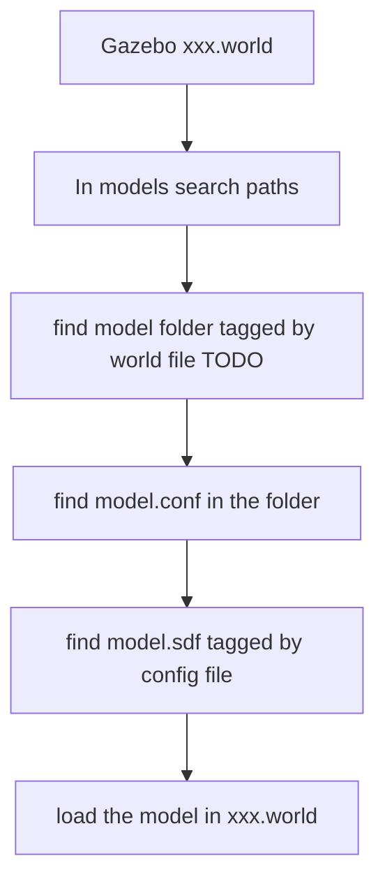

# Gazebo Learning Notes

 [Official tutorial](http://gazebosim.org/tutorials) 

Recite the knowledge in my WORDS.

[toc]

## 00. Problems encountered

- Run gazebo, problem like [this](https://blog.csdn.net/qq_43802597/article/details/97996255) .

- Can not load world file , the Gazebo goes black.

  Gazebo can not find the model used in world file.

- Gazebo9 has installed iginition-transport4 [solution](https://blog.csdn.net/fanky_chan/article/details/100743255) 

- If Gazebo dose not find plugin, no any warning and error. So when you write a plugin, print sth.

- convert `.urdf` to `.sdf` , encoutered problem [link](https://answers.gazebosim.org//question/21441/the-minimum-corner-of-the-box-must-be-less-than-or-equal-to-maximum-corner/) 


## 01. Base

### 01-01. Common use of `gazebo`

The `Gazebo ` command actually runs 2 different executables. First is `gzserver` , second is `gzclient` .

The `gzserver` executable runs the physics update-loop and sensor data generation. 

```bash
gzserver <world_filename>	# load the world file
gzserver -s <plugin_filename> # load the plugin, plugin is always a libXXX.so
```

The `gzclient` executables runs a QT based user interface.

```bash
gzclient --gui-client-plugin <plugin_filename> # load the plugin, plugin is always a libXXX.so
```

- Load the  world files

  > gazebo worlds/pioneer2dx.world

### 01-02. Short Introduction to World Files and Model Files

World file has an extra \<world\> block compared to model file.

- World files located in `/usr/share/gazebo-9/worlds` , world files search paths are below:

  1. relative to current directory
  2. an absolute path
  3. relative to a path component in `GAZEBO_RESOURCE_PATH` 
  4. `worlds/<world_name>` , where \<world_name\> is installed with Gazebo

- world files contains all the elements in a simulation, including robots, lights, sensors and static objects by \<include\> tag for model files.

  ```xml
  <include> 
      <uri>model://model_file_name</uri>
  </include>
  ```

- Model files and world file both use SDF(Simulation Description Format). World files typically have a `.world` extension. Model files have a `.sdf` extension. Model files can facilitate reuse of models and simplify world files.

- Here are some Gazebo's environment variables

  `GAZEBO_MODEL_PATH` , `GAZEBO_RESOURCE_PATH` , `GAZEBO_MASTER_URI` , `GAZEBO_PLUGIN_PATH`,  `GAZEBO_MODEL_DATABASE_URI` 

  ```bash
  # use default setting or check it
  source usr/share/gazebo/setup.sh
  ```

### 01-03. Gazebo Distributed Architecture

The whole system include 7 parts: 

1. Gazebo master: topic management

2. communication library: bridge between server and client

3. physics library, rendering library, sensor generation: mainly server's job
4. GUI, plugins: mainly client's job

- gzserver: simulate the physics, rendering and sensors
- gzclient: provide a graphical interface to visualize and interact

### 01-04. Gazebo UI and Tools

- gz log
- hdf5 dataset
- applying force 

- use UI to build and modify world
- import DEM and plant satellite images

- [Model Editor](http://gazebosim.org/tutorials?tut=model_editor&cat=build_robot) is a little troublesome building a model but worth a try.

- [Extrude SVG Files](http://gazebosim.org/tutorials?tut=extrude_svg&cat=model_editor_top) is a useful function of model editor. It allows you to build a 3D model from a 2D svd file.

### 

## 02 Model Files 

### 02-01. How Does Gazebo Find Designated Model? 

The file organization of the model database and models

- Database [official database link](https://github.com/osrf/gazebo_models) 
  - Database.config
  - model_01
    - model.config
    - model.sdf
    - meshes/ `.dae` , `.stl`  files
    - materials/ texture and scripts
    - plugins/


**How does Gazebo find designated model?**



In the \<model\> tag of world file, it tells the folder name in folder search paths.

One of model search paths located in `~/.gazebo/models/` 

In `~/.gazebo/models/<YourDesignatedModelFolder>` find `model.config` or the file with a `.config` extension

Eventually Gazebo loads the model tagged \<model\> by `model.config` 

### 02-02. Config File and SDF File

 [Click Here to See More](http://gazebosim.org/tutorials?tut=model_structure&cat=build_robot) 

Below is `model.config` file:

```xml
<?xml version="1.0"?>

<!-- specify the model.sdf -->
<model>
  <name>My Model Name</name>
  <version>1.0</version>
  <sdf version='1.5'>model.sdf</sdf>

  <!-- information about the model -->
  <author>
    <name>My name</name>
    <email>name@email.address</email>
  </author>

  <description>
    A description of the model
  </description>
    
  <!-- optional args. All the dependencies for this model. This is typically other models.-->
  <depend>
        
  </depend>
</model>
```

SDF file represents a model.

SDF model has 3 main parts: links, joints and plugins.

- links: collision, visual, inertial, sensor, light

  For example, a table model could consist of 5 links (4 for the legs and 1 for the top) connected via joints. However, this is overly complex, especially since the joints will never move. Instead, create the table with 1 link and 5 collision elements.

- joints: connects two links

- plugins: a shared library created by a third party to control a model

```xml
<?xml version='1.0'?>
<sdf version="1.4">
  <model name="my_model">
    <pose>0 0 0.5 0 0 0</pose>
    <static>true</static>
    <link name="link">
      <inertial>
        <mass>1.0</mass>
        <inertia> <!-- inertias are tricky to compute -->
          ...
        </inertia>
      </inertial>
      <collision name="collision">
        <geometry>
          <box>
            <size>1 1 1</size>
          </box>
        </geometry>
      </collision>
      <visual name="visual">
        <geometry>
          <box>
            <size>1 1 1</size>
          </box>
        </geometry>
      </visual>
    </link>
  </model>
</sdf>
```

Here is a quite detailed tutorial to [Build a Mobile Robot](http://gazebosim.org/tutorials?tut=build_robot&cat=build_robot). 

**Layer**

You could put a \<layer\> tag in the model \<visual\> block 

```xml
<visual name='visual_0'>
  <meta>
    <layer>0</layer>
  </meta>
  ...
</visual>
```

**Population of Model** 

```xml
<population name="can_population1">
    <model name="can1">
        <include>
            <static>true</static>
            <uri>model://coke_can</uri>
        </include>
    </model>
    <pose>0 0 0 0 0 0</pose>
    <box>
        <size>2 2 0.01</size>
    </box>
    <model_count>10</model_count>
    <distribution>
        <type>random</type>
    </distribution>
</population>
```


### 02-03. Use Meshes

 [Click Here to See More](http://gazebosim.org/tutorials?tut=build_robot&cat=build_robot) 

```xml
<visual name="visual">
  <pose>0 0 0 1.5708 0 0</pose>
  <geometry>
    <mesh><uri>file://duck.dae</uri></mesh>
  </geometry>
</visual>
```

Test the mesh by loading the world file by `gazebo` command

Remember to put `.dae` file to the same directory with world file

```xml
<visual>
<geometry>
    <mesh>
        <uri>model://pioneer2dx/meshes/chassis.dae</uri>
        <scale>0.9 0.5 0.5</scale>
    </mesh>
</geometry>
</visual>
```

Or download the model `pioneer2dx` to model search paths. Designate the mesh file. 

### 02-04. Composite Model

Prerequisites:  [Build a Mobile Robot](http://gazebosim.org/tutorials?tut=build_robot&cat=build_robot). 

Insert these following lines before \</model\> tag

```xml
<include>
    <uri>model://hokuyo</uri>	<!-- where to find hokuyo model -->
    <pose>0.2 0 0.2 0 0 0</pose>
</include>
<joint name="hokuyo_joint" type="fixed">
    <child>hokuyo::link</child>	<!-- in hokuyo sdf file, the link name of hokuyo is `link` -->
    <parent>chassis</parent>	<!--  in my_robot sdf file, the link name is `chassis`-->
</joint>
```

The `<include>` block tells Gazebo to find a model, and insert it at a given `<pose>` relative to the parent model.

A more complicated composite tutorial is here: [01. Make a Simple Gripper](http://gazebosim.org/tutorials?tut=simple_gripper&cat=build_robot) and [02. Attach Gripper to Robot](http://gazebosim.org/tutorials?tut=attach_gripper&cat=build_robot) 

Pay attention to the coordinates system.

Tutorial for [Nested Model](http://gazebosim.org/tutorials?tut=nested_model&cat=build_robot). 

### 02-05. Make Animation

\<actor\> block is similar to \<model\> 

There are two types of animations which can be used separately or combined together:

1. Skeleton: relative motion between links in one model
2. Trajectory: carries all of the actor's links around the world, as one group

An example of animation

```xml
<sdf version="1.6">
  <world name="default">
    <include>
      <uri>model://sun</uri>
    </include>
    <actor name="actor">
      <skin>
        <filename>walk.dae</filename>
      </skin>
      <animation name="walking">
        <filename>walk.dae</filename>
        <interpolate_x>true</interpolate_x>
      </animation>
      <script>
        <trajectory id="0" type="walking">
          <waypoint>
            <time>0</time>
            <pose>0 2 0 0 0 -1.57</pose>
          </waypoint>
          ...
        </trajectory>
      </script>
    </actor>
  </world>
</sdf>
```

See more in [Animation Box](http://gazebosim.org/tutorials?tut=animated_box&cat=build_robot) and [Make an Animation Model](http://gazebosim.org/tutorials?tut=actor&cat=build_robot) 

## 03. Gazebo Plugin

http://gazebosim.org/tutorials?tut=actor&cat=build_robot 

http://gazebosim.org/tutorials?tut=introspection&cat=tools_utilities

### 03-01. Introduction

A plugin is a chunk of code that is compiled as a shared library and inserted into the simulation. 

6 types: world, model, sensor, system, visual, GUI

 [5 Simple exercise ](http://gazebosim.org/tutorials?cat=write_plugin) 

- occupied event
- contain plugin
- mechanism of plugin [link](http://gazebosim.org/tutorials?tut=flashlight_plugin&cat=plugins) 


## 04. ROS and Gazebo

build washing robot 

https://blog.csdn.net/Travis_X/article/details/104134657

https://blog.csdn.net/weixin_44172961/article/details/93886674


