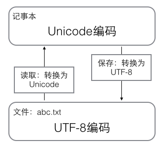
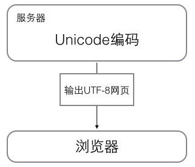

# Python Learning Note

[python教程 廖雪峰](https://www.liaoxuefeng.com/wiki/0014316089557264a6b348958f449949df42a6d3a2e542c000/001431611988455689d4c116b2c4ed6aec000776c00ed52000)

[TOC]

## 0.简介

高级编程语言, 通常会提供一个比较完善的基础代码库, 可以直接调用

应用: 网络应用(网站, 后台服务), 小工具(脚本), 其他语言程序的再包装

解释型语言, 速度慢, **代码不能加密**(只有源码, 不像c有机器码)


## 1.基础

### 1.1 第一个小程序

命令行和Python交互模式

`print()` 和 `input()` 函数

### 1.2 缩进 

`:` 结尾, 视作代码块(相当于C++的 `{}` )

```python
a = 100
if a>= 0:
    print(a)
else:
    print(-a)
```

使用空格缩进, 4个空格

大小写敏感

### 1.3 变量

整形, 浮点, 字符串(不变), 布尔, 空值, 变量, 常量

字符串注意转义符 `\`

布尔 `and` `or` `not`

Python是动态语言, 更加灵活

```python
a = 'ABC'
b = a	# pointer in cpp
a = 'XYZ'
print(b) # ABC
```

```python
9 / 3	# 3.0 浮点除
10 // 3	# 3 取整除
10 % 3	# 1 取余
```

注意赋值的时候, python在内存中地址的操作是按照指针来, 但是后续又不影响

所以但从现象来看, 倒像是两个类型的对象

### 1.4 字符编码

`ASCII` 编码: 127个字符, 1个字节, 只支持英文和某些字符

`Unicode` 编码: 解决多语言的乱码, 但是存储和传输不便

`UTF-8` 编码: 根据不同字符大小编码成1-6个字节, 英文1个字节, 汉子3个字节, 节省空间

记事本打开时的编码转换




网站打开时的编码转换



python字符是 `Unicode` 编码, 支持多语言

```python
ord('A') # 65 ord()获取字符的整数表示
ord('中')	# 20013
chr(66)	# 'B' chr()编码转换为字符
# 十六进制还能这么写
'\u4e2d\u6587'	# '中文'
```

内存中 `str` 以 `Unicode` 表示, 网络传输或者保存磁盘, 需要转换成以字节为单位的 `bytes`

可以使用 `encode` 把 `str` 编码为指定的 `byte`

可以使用`decode` 把 `byte` 变成 `str`

```python
x = b'ABC'
y = 'ABC'
'abc'.encode('ascii')	# b'abc'
'任家平'.encode('utf-8')	# b'\xe4\xbb\xbb\xe5\xae\xb6\xe5\xb9\xb3'
b'abc'.decode('ascii')	# 'abc'
b'\xe4\xbb\xbb\xe5\xae\xb6\xe5\xb9\xb3'.decode('utf-8') # '任家平'
```

在 `.py` 的首行可以写

```python
#!/usr/bin/env python3
# _*_ coding:utf-8 _*_
```

第1行告诉Linux系统, 这是一个Python可执行程序

第2行告诉Python解释器, 按照 `UTF-8` 读取源码, 否则会有乱码, 前提是写入文件也用的是 `UTF-8`

### 1.5 格式化

在字符串内部使用 `%` 运算符进行字符串格式化

```python
# %s 字符串替代, %d 整数替代
# %f 浮点数替代, %x 16进制证书
'Hi, %s, you fucked up' % 'RJP'
'hi, %s, you have %d' % ('RJP', 1000)
# 整数的位数和0格式化, 还有浮点数的小数位格式化
print ('%2d-%02d' % (3,1))	#  3-01
print ('%.2f' % 3.1415926)	# 3.14
```

在现在的实验里面, `print()` 只能给一个语句格式化

`%` 格式化符号只格式化前面紧跟的字符串

### 1.6 `List` 和 `tuple`

`list` 和cpp的 `vector` 用法差不多,   

不同的是 `list` 可以通过负数的索引, 从后到前取值

```python
l = ['r', 'j', 'p']
print (l[-1])	# 'p'
```

如果 `list` 长度是 `n`, 那么索引范围是 `0` 到 `n-1`, `-n` 到 `-1` 

```python
list.append('123')
list.insert(pos,'123')	# pos 0~n-1
list.pop(pos = n-1);
list = ['123', 1, True]
list = ['123', 1, ['r', True], False]
list = []
```

`tuple` 和 `list` 大致相同, 没有 `append()` 和 `insert()` 

`tuple` 的元素不可变, 无法在除了初始化以外的位置赋值

```python
tuple = ('r', 'j', 'p')
tuple = ()
tuple = (1)	# 歧义, 此时定义的不是tuple而是1, 因为语义有冲突, python默认小括号计算
tuple = (1,)	# 因此为了避免歧义

tuple = ('a', 'b', ['A', 'B'])
tuple[2][0] = 'X'
tuple[2][1] = 'Y'	# 合法
```

注意, `list` 和 `tuple` 元素的内存地址是伪线性, 相同类型的相连变量内存地址是连续的, 但是一旦元素类型不同, 内存地址会出现跳变

### 1.7 条件判断, 循环, 

`if` , `elif` , `else`  

```python
l = ['j', 'r', 'p']
for i in l:
    print (i)
    
n = 1
while (n < 100):
    print (n)
    n = n + 1
    if (n > 10):
        break
```

循环语句的 `break` 和 `continue` 的用法和cpp一样

### 1.8 `dic` 和 `set`

`dic` 相当于cpp的 `map`, 映射

```python
# 无序, 类型任意
d = {1:22, 3:321, 'rjp':'fd'}
print (d['rjp'])

# 此时只要不是 d[0], 其他索引值都是1222
d = {0:, 222:'fdasf', True:1222}
```

`dic` 通过 `Hash` 算法通过 `key` 来计算 `value` , `key` 不能变

`set` 无重复对象

### 1.9 函数

关于函数的一些基础

```python
# 函数的调用
abs(5.3)
a = abs	# 随时定义函数的引用
a(-7.9)

# 函数的定义
def my_abs(x):
    if not isinstance(x,(int, float)):	# 检查参数的正确性
        raise TypeError('wrong type')	# 如果没有该句, 传入str会在if报错
    if (x >= 0):
        return x
    else:
        return -x
    
from test_class import func()

# 多个返回值的函数
import math
def move(x, y, step, angle = 0):	# 缺省
    nx = x + step * math.cos(angle)
    ny = y + step * math.sin(angle)
    return nx, ny
# (6.0, 0.0) 返回的是一个元组 tuple

# 函数缺省参数
def power(x, n = 2) 
```

不同于Cpp的地方: 可变参数

```python
# 可变参数
def calc(numbers):
    sum = 0
    for n in numbers:
        sum = sum + n * n
    return sum
calc([1,2,3])

def calc(*numbers):	# 这不是指针
    sum = 0
    for n in numbers:
        sum = sum + n * n
    return sum
calc(1,2,3)	# 使用可变参数后,将传入的参数装进tuple
calc()	# 0   相当于可以直接重载多个参数

n = [1,2,3]	# 如果声明了可变参数, 但是还是的传入列表
calc(*n)	# 在调用函数时, 给参数前面加一个 * 即可, 这种写法很常见
```

关键字参数

```python
# 关键字参数
# 本质也是一个可变参数, 把数据装进了dic, 是传值, 深拷贝
def person(name, age, **kw):
    print('Name:', name, 'age:', age, 'other:', kw)

person('rjp', 22)	# Name: rjp age: 22 other: {}

# 直接使用可变参数类型没有单引号, 赋值用等于号
person('rrr', 21, city = 'xian', sex_tend = 'gay') 

# 直接传入dic的时候, 使用两个星号
ddd = {'city':'shanxi', 'job':'teacher'}
person('kk', 32, **ddd)
```

命名关键字参数

```python
# 命名关键字参数
# 针对关键字参数进行筛选, 只能输入想要的参数
def person(name, age, *, city, job):	# * 后面是限制的参数
    print(name, age, city, job)

# 正常调用
person ('rjp', 21, city = 'xm', job = 't')	

# 报错, 不存在sex_tend参数
person ('jj', 22, sex_tend = 'fdf', city = 'jj', job = 'kk')
```

### 1.10 递归

```python
# 一般的递归
def fact(n):
    if n == 1:
        return 1
    else:
        return n * fact(n-1)
```

上述的递归是通过栈(Stack)这种数据结构实现的, 递归调用次数过多, 会导致栈的溢出

解决方案是通过**尾递归**优化, 把每一步的成绩传入到递归函数去

```python
def fact(n):
    return fact_iter(n, 1)
def fact_iter(num, product):
    if num == 1:
        return product
    return fact_iter(num - 1, num * product)
```

虽然具体原理不懂, 但是这么做应该没什么大问题


## 2.高级特性

简单的代码实现复杂的功能

### 2.1 切片

通过 `:` 更加快捷的取出 `list` 之中的数据, 返回值是 `list`, 不改变原数据

`tuple` 切片的返回值依然是 `tuple`

```python
list = [0, 1, 2, 3, 4, 5, 6, 7, 8, 9]
# start_pos & end_pos [0, len - 1]
# 包括start_pos自己, 不包括end_pos
# 步长为step
list[start_pos:end_pos:step]	
# instance
list[0:3] = list[:3]	# 从0的位置读到2(3-1)的位置: [0, 1, 2]
list[::2]	# 每隔两个取一个

```

写一个 `trim` 函数, 去掉字符串两端的空格

```python
def trim_string(str):
    if str[0] == ' ' and str[-1] == ' ':
        return trim_string(str[1:-1])
    elif str[0] == ' ' and str[-1] != ' ':
        return trim_string(str[1:])
    elif str[0] != ' ' and str[-1] == ' ':
        return trim_string(str[:-1])
    else:
        return str
```


### 2.2 迭代

```python
d = {'a': 1, 'b': 2, 'c': 3}
for key in d.keys():
    print (key)

for value in d.values():
    print (value)

for k,v in d.items():
    print (k,v)
```


### 2.3 列表生成式

如果要生成 `[1, 4, 9, 16, 25, 36,..., 100]`

使用语句 `[x * x for x in range(1,11)]`

还可以添加条件判断 `[x * x for x in range(1,11) if x % 2 == 0]`


`for` 循环可以一次两个变量, 如 `dic` 的 `item` , 列表生成式也可以

`[m + n for m in 'ABC' for n in 'XYZ']`

`[k + '=' + v for k, v in dic.items()] `


列表生成式里面也可以使用各种方法

`[s.lower() for s in List]`

`[s.lower() for s in List if isinstance(s, str)]`


### 2.4 生成器

通过列表生成器, 可以直接创建复杂的列表

如果列表够长, 但只需要使用列表的前几个元素, 会造成空间的浪费

如果列表元素可以根据某种算法推算出来, 不必创建完整的列表, 可以在循环的过程中推算除后续元素

边计算边循环的机制叫做 `generator`


定义 `generator` 方法:

- 列表表达式的 `[]` 变成 `()`

  `g = (x * x for x in range(10))` 之后用 `for` 把它 `print` 出来

- 函数包含 `field` 关键字

  ```python
  def fib(max):
      n, a, b = 0, 0, 1
      while n < max:
          yield b
          a, b = b, a+b
          n = n + 1
      return 'done'	# 不会有返回值, 是因为返回值在 StopIterartion 中
  ```


### 2.5 迭代器

可用于 `for` 循环的数据类型有:

一类是集合数据类型, 如 `list` , `tuple` , `dic` , `set` , `str`

一类是生成器, `generator` 和 `generator function`

他们统称为可迭代对象 `Iterable`


可以使用 `next()` 的都是迭代器 `Iterator`

`generator` 是迭代器

可以使用 `iter()` 把 `Iterable` 变成 `Iterator` 类型

<font color= red> **WTF**</font>

**是不是意味着 `list` , `tuple` , `dic` , `set` , `str` 都是 `iterable` 的子类**

**而 `Iterable` 是父类**


## 3.函数式编程

函数是面向对象程序设计的基本单元

但是**函数式编程**也可以归结到面向过程的编程, 但是思想更加接近数学计算

它是一种抽象程度很高的编程范式

其特点是, 允许把函数本身作为参数传入另一个函数, 还允许返回一个函数

### 3.1 高阶函数

变量可以指向函数, 函数名也是变量

```python
abs = 10
abs(-9)	# 报错
```

变量也可以指向函数, 函数的参数能接收变量, 说明一个函数可以当做另一个函数的参数

这种函数可以成为高阶函数

```python
def add(x, y, f):
    return f(x) + f(y)
```

- `map` 和 `reduce` 函数

  `map` 函数接收两个参数, 一个是函数, 一个是 `Iterable` , `map()` 将传入函数一次作用到序列的每个元素, 并作为新的 `Iterator` 返回

  ```python
  def f(x):
      return x * x
  r = map(f,[1, 2, 3, 4, 5])
  list(r)	# [1, 4, 9, 16, 25]
  
  print(list(map(str, [1, 2, 3, 4, 5])))
  ```

  `reduce()` 的用法. `reduce` 把一个函数作用在一个序列上, 这个函数必须接收两个参数, `reduce` 把结果继续和下一个元素做累积运算

  ```python
  def add(x, y):
      reutrn x + y
  reduce(add, [1, 3, 5, 7, 9])	# 25
  ```

- `filter()` 函数

  接收一个函数一个序列, `filter()` 把传入的函数依次作用于每个元素, 然后根据返回值是 `True` 或者 `False` 决定是删除还是保留元素

  返回值是一个 `Iterator`

  ```python
  # 使用filter函数筛选回数
  def judge_palindrome(n):
      n_str = str(n)
      n_len = len(n_str)
      i = 0
      is_palindrome = True
      while i < n_len - 1:
          i = i + 1
          if n_str[i] != n_str[n_len - 1 - i]:
              is_palindrome = False
              break
      return is_palindrome
  
  re = filter(judge_palindrome, [121, 3325, 737138, 7491731, 12376, 328823])
  
  print (list(re))
  ```

- `sorted` 函数

  可以对 `List` 进行排序, 需要给一个 `key` 关键字

  ```python
  sorted([1, 2, -4, -10, 7, 0.4], key = abs, reverse = True)
  ```


### 3.2 返回函数

屎一样的难受

``` python
def lazy_sum(* args):
    def sum():
        ax = 0
        for n in args:
            ax = ax + n
        return ax
    return sum	# 调用 lazy_sum 返回的是求和函数
f = lazy_sum(1, 3, 5)
f()	# 调用f()函数, 结果是9
```


  ### 3.3 匿名函数

```python
list(map(lambda x: x * x, [1, 2, 3, 4, 5]))
```


### 3.4 装饰器

希望增加函数功能, 又不希望修改函数的定义

在代码运行期间动态增加功能的方式, 称之为**装饰器**  `Decorator`

和设计模式有想通之处

注意, 返回值的`()`

```python
def log(func):
    def wrapper():
        print ('call %s():' % func.__name__)
        return func()
    return wrapper

@log    # 相当于语句 now = log(now)
def now():
    print ('rjrjjr')
now() 
# output
# call now()
# rjrjjr

# 三重嵌套
def log(text):
    def decorator(func):
        def wrapper():
            print ('%s %s(): ' % (text, func.__name__))
            return func()
        return wrapper
    return decorator

# @log('fuck')
def now():
    print ('rjrjjr')

now = log('fuck')(now)
# log('fuck') = decorator
# log('fuck')(now) = decorator(now)

now()
```


### 3.5 偏函数

```python
# int函数, 转成2进制
int('12345', base = 2)

# 定义int2函数, 功能如上
def int2(x, base = 2):
    return int(x, base = 2)

# 使用偏函数定义
int2 = functools.partial(int, base = 2)
```

关于偏函数的创建


```python
# 创建偏函数可以接受函数对象, *args, **kw
kw = {'base': 2}
int('1000', **kw)

max2 = functools.partial(max, 10)
# 实际会把10当做 *args可变参数传入max函数
```


## 4.模块

每个 `.py` 文件称之为一个模块

引入包 `pkg` 来避免模块名字的冲突

每个 `pkg` 里面必须有一个 `__init__.py` 的文件, 否则会当做普通目录处理

注意命名不要有冲突

### 4.1 使用模块

```python
#!/usr/bin/env python3
# _*_ coding: utf-8 _*_

'a test module'	# 模块的注释

__author__ = 'rjp'	# 作者的注释

import sys	# 引入模块

def test():
    args = sys.argv
    if len(args) == 1:
        print ('hello, motherfucker')
    elif len(args) == 2:
        print ('why not go fuck yourself')
    else:
        print ('eat your dick')

if __name__ == '__main__':	# ????
    test()
```

只希望在模块内部使用的变量和函数(私有变量), 通常使用前缀 `_`

虽然 `python` 并不会阻止你直接在模块外调用私有变量和函数

但是不建议你直接调用

### 4.2 安装第三方模块

通过包管理工具 `pip` 完成

发现自己安装的 `numpy` 没有办法 `import` 进来

原来是环境配置有问题


解释器要选择系统变量, 而不是新创建

每一回我都是根据项目新创建一个解释器(基于系统)

然而, `numpy` 库是安装在系统的 `python` 变量中

所以无法 `import` 


## 5.面向对象编程

### 5.1 类和实例

```python
class Student(object):
    
    def __init__(self, name, score):	# 第一个参数永远是self
        self.name = name	# 直接把属性绑定上去
        self.score = score
    
    def print_score(self):
        print('%s %s' % (self.name, self.score))
```

### 5.2 限制访问

初始化的时候给变量前面加两个下划线 `__`

但是 `python` 里面用双下划线开头, 双下划线结尾的是特殊变量

特殊变量可以直接访问, 所以在类中变量的命名里面, 不允许像特殊变量一样命名


但其实使用双下划线也可以在外部访问

`_<ClassName>__<VariableName>`

所以靠自觉


有一个陷阱

```python
student.__name = 'new name'
student.__name	# 实际只是给student新增了一个变量
```


### 5.3 继承和多态

子类同名方法会自动继承父类的同名方法

相对于cpp, python确实显得太简单了


### 5.4 获取对象信息

```python
type(123)

def fn():
    pass
type(fn)	# types.FunctionType

isinstance(123, int)

dir()	# 获得一个对象的所有属性和方法
```


### 5.5 实例属性和类属性

直接定义就好


## 6.面向对象高级编程

前一章节只是介绍了 封装, 继承和多态3个基础概念

这一章节介绍更加高级的特性


### 6.1 使用 `__slots__`

限制类能添加的属性, 使用 `tuple` 定义

```python
class Student:
    __slots__ = ('name', 'age') # tuple
```

`__slots__` 仅对当前的类有效, 对子类没有限制效果


### 6.2 使用 `@property`

`@property` 本质是装饰器 `decorator` , 负责把一个方法变成属性调用

```python
class Student(object):
    
    @property
    def score(self):
        return self._score
    
    @score.setter	# 注意这里的setter是自动补全出来的
    def score(self, value):
        self._score = value
```


### 6.3 多重继承

`MixIn` 的设计模式


### 6.4 定制类

我们已经知道的是 `__init__()` , `__len__()` 

其实还有 `__str__()` , `__iter__()` , `__repr__()` , `__getattr__()`

不赘述了, 太无聊了


### 6.5 使用枚举类

```python
rom enum import Enum, unique

Month = Enum('Month', ('Jan', 'Feb', 'Mar'))

for name, member in Month.__members__.items():
    print (name, '-->', member, ',', member.value)

@unique #装饰器, 可以帮我们检查有没有重复值
class Weekday(Enum):
    sun = 0
    mon = 1
    tue = 2
```


### 6.6 使用元类

`type()` 不仅可以查看变量类型, 还可以动态地创建类

`metaclass` 元类

先定义 `metaclass` , 就可以创建类, 最后创建实例


这在是正真的面向对象

